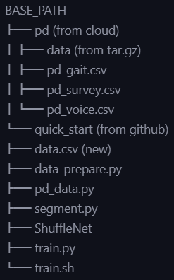

<!--
 * @Author: mrk-lyz mrk_lanyouzi@yeah.net
 * @Date: 2022-06-24 21:18:08
 * @LastEditTime: 2022-06-24 21:33:55
 * @FilePath: /quick_start/Readme.md
 * @Description: 
 * 
 * Copyright (c) 2022 by mrk-lyz mrk_lanyouzi@yeah.net, All Rights Reserved. 
-->
# Tutorial of Drug Resistance Detection

## Environment Initialing

1. **Download the reposity.**

2. **Create a new conda enviroment.**

   ```python
   conda create -n pd python=3.8
   conda activate pd
   pip install -r requirements.txt
   
   ```

## Data Preprocessing

1. **Download datasets.** Required data has been uploaded to CASE Server. You can find it in path `/Data/common/`. ~~You can download PD datasets here and transfer files to the cloud server.~~

```bash
   cd /Data/common
   tar -zxvf data.tar.gz
```

1. **Generate spetrograms.** The raw dataset contains temporal signals acquired by accelerometers. The first step is to convert them into time-frequency spectrograms. We mainly concentrate on **forward walking** data, you can also select **backward** by changing `is_back` in the file. Besides, you may need to modify `data_dir`, which represents the dataset folder. After that you will get `result` and `result_backward` folders in the sibling directory. **You can also directly use the spectrograms we have prepared in advance as you wish.**

```bash
    cd quick_start
    unzip ShuffleNet.zip
    python segment.py
```

1. **Make pairings.** Since we want to identify whether the patient develops resistance to the drug, we need to prepare spectrogram pairings. The main idea is to use the earliest post-dose data to match the latest pre-dose data. You are supposed to modify saveral parameters: `spg_path`(spectrogram directory), `data_dir`(the same as step 2) and `topk`(subjects numbers).

   ```bash
   python data_prepare.py
   ```

## Quick Start

Now suppose you have the following file structure:



<!-- BASE_PATH
├── pd (from cloud)
│   ├── data (from tar.gz)
│   ├── pd_gait.csv
│   ├── pd_survey.csv
│   └── pd_voice.csv
└── quick_start (from github)
    ├── data.csv (new)
    ├── data_prepare.py
    ├── pd_data.py
    ├── segment.py
    ├── ShuffleNet
    ├── train.py
    └── train.sh -->

And then you can  train directly. You may need to modify some parameters, the description of which are given in `train.py`. Given the large size of the dataset, we used a downsampling method (`WeightedRandomSampler`) to speed up the training stage.

```bash
sh train.sh
```

Notice that this project is just a simple sample for quick start. We do NOT use sophisticated models and subtle optimizations. If you want to get a higher performance, **you can customize the model structure and training process.**
